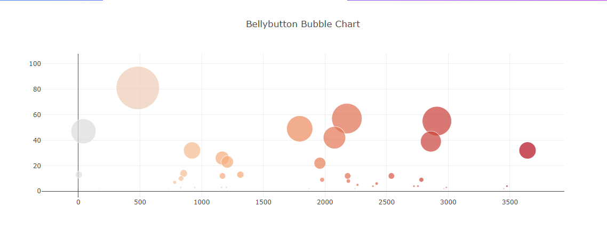

# Unit 14 Homework: Belly Button Biodiversity

For this assignment, the goal was to build an interactive dashboard to explore the [Belly Button Biodiversity dataset](http://robdunnlab.com/projects/belly-button-biodiversity/), which catalogs the microbes that colonize human navels.

The dataset revealed that a small handful of microbial species (also called operational taxonomic units, or OTUs, in the study) were present in more than 70% of people, while the rest were relatively rare.

## Completed the following steps:

1. Used the D3 library to read in `samples.json` from the URL `https://2u-data-curriculum-team.s3.amazonaws.com/dataviz-classroom/v1.1/14-Interactive-Web-Visualizations/02-Homework/samples.json`.

2. Created a horizontal bar chart with a dropdown menu to display the top 10 OTUs found in that individual.

  * Used `sample_values` as the values for the bar chart.

  * Used `otu_ids` as the labels for the bar chart.

  * Used `otu_labels` as the hovertext for the chart.

  

3. Created a bubble chart that displays each sample.

  * Used `otu_ids` for the x values.

  * Used `sample_values` for the y values.

  * Used `sample_values` for the marker size.

  * Used `otu_ids` for the marker colors.

  * Used `otu_labels` for the text values.

4. Displayed the sample metadata, i.e., an individual's demographic information.

5. Displayed each key-value pair from the metadata JSON object somewhere on the page.

6. Updated all the plots when a new sample is selected.

7. Deployed the app to GitHub Pages.

## Advanced Challenge Assignment (Optional)

* Adapted the Gauge Chart from <https://plot.ly/javascript/gauge-charts/> to plot the weekly washing frequency of the individual.

* Modified the example gauge code to account for values ranging from 0 through 9.

* Updated the chart whenever a new sample is selected.

